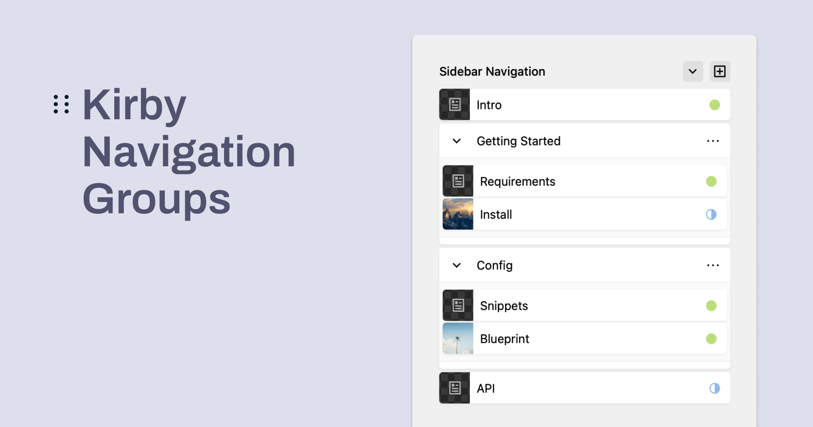

# Kirby Navigation Groups


A plugin for Kirby CMS that allows you to organize your navigation items into groups.



## Features

- Create and manage navigation groups
- Drag & drop interface for organizing pages
- Sync sort order with folder structure
- Multi-language support (EN, DE, FR, ES, IT)
- Customizable group fields

## Installation

### Download

Download and copy this repository to `/site/plugins/kirby-navigation-groups`

### Composer
``` bash
composer require philippoehrlein/kirby-navigation-groups
```

## Usage

1. In your blueprint, add a field of type `navigationgroups`:


```yaml
fields:
  navigation:
    label: Navigation
    type: navigationgroups
```

2. Optional: Add custom fields to your groups and filter pages by status:

```yaml
fields:
  navigation:
    label: Navigation
    type: navigationgroups
    status: listed
    fields:
      description:
        type: textarea
        label: Description
      toggle:
        label: Toggle group
        type: toggle
        text:
          - "no"
          - "yes"
```


## Options

The plugin supports the following options:

- `status`: Filter for page status ('all', 'listed', 'unlisted', 'published', default: 'listed')
- `fields`: Additional fields for groups


## Field Methods
The plugin provides the Field Method `toGroupItems()` to access the stored navigation items:

```php
<?php
$items = $page->navigation()->toGroupItems();
?>

<nav class="navigation">
  <ul>
  <?php foreach ($items as $item): ?>
  <?php if ($item->type() == 'group'): ?>
    <li>
      <h2><?= $item->title() ?></h2>
      <ul>
        <?php foreach ($item->pages() as $subPage): ?>
          <li><a href="<?= $subPage->url() ?>"><?= $subPage->title() ?></a></li>
        <?php endforeach; ?>
      </ul>
    </li>
  <?php else: ?>
    <li><a href="<?= $item->url() ?>"><?= $item->title() ?></a></li>
  <?php endif; ?>
  <?php endforeach; ?>
  </ul>
</nav>
```

## Development

If you want to contribute to the development of this plugin, follow these steps:

1. Clone the repository.
2. Install dependencies using Composer.
3. Make your changes and test them in your Kirby installation.

## License

This plugin is open-source and available under the [MIT License](LICENSE.md).